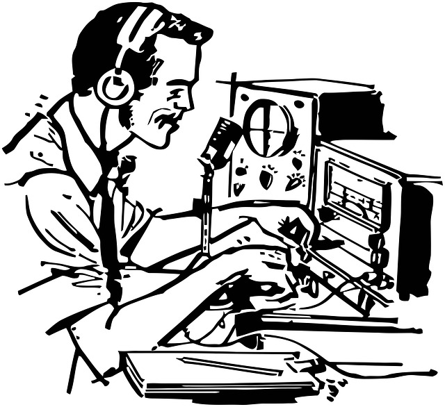

The goal here is simple: make this the resource I wish I had a couple of months ago. Illustrate all the amazing things you can do with ham radio. Document and consolidate the information that is spread across the internet. And most important, don't let this be another abandoned blog.

There are already plenty of people on Youtube, Twitter, and elsewhere providing information and content that helped me get started. But the content is varied and sometimes what seems like a simple question can be incredibly hard to track down.

## About Me
I am a 40 something dad with a technical background and an existing supply solder, Arduinos, and Raspberry Pis. My professional life revolves around spatial data (lat/long) and I hope to apply what I already know to ham radio.

## How I got here
I'm not quite sure, but something led me to dig into the ham radio world and realize it's so much more than talking to people. My initial interest is gravitating towards QRP, HF, and digital. 

## Whats Next?
I didn't start this blog on day one. So I have a bit of catching up to do. Getting on the air, UHF/VHF, built my first dipole, and making my first contact. But I have a lot ahead of me. I have yet to create a permanent entry point for coax into the shack and haven't even touched digital.

Here's to exploring a world of 1000 rabbit holes and seeing projects through to the end!    