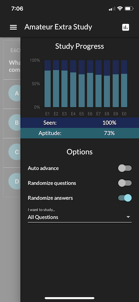

<!-- ***Getting Started Series***
:---------------------------------------
[Get On The Air](./get-on-the-air)
[Radios](./radios)
[Antennas](./antennas)
[Operating](./operating)

--- -->

## Step One - Get Your License

Coming into ham radio completely blind can be overwhelming. My goal was to get on the air as quickly as possible in 3 steps:

1. Listen to as many bands as possible (no license required)
2. Make contact with local repeaters (VHF/UHF)
3. Make long-distance contact on High Frequency (HF)

Your job is to stay focused on getting on the air. **Don't go out and buy a bunch of equipment**. Ultimately my initial gear purchases happened over a few months: [SDR Play](https://www.sdrplay.com/) --> Baofeng --> Yaesu FT-891. The gear aligned with my initial goals, and aside from antennas, should get me by for a while before I need to upgrade.

The SDR play allowed me to listen to HF/VHF/UHF all for about $100. The Baofeng is not a favorite of the ham radio world, but it's cheap and accessible. The Yaesu was my last purchase and is mobile but robust enough for digital modes.

The following is focused on helping you get your license. It isn't a step-by-step guide. But I did try to stuff as much useful info in here as possible for anyone that is starting at step one.

>“Perfection is the enemy of progress.” — Winston Churchill
## The Test(s)
The currently available license levels are Technician, General, & Extra. With each level, you are granted more access to amateur radio bands. How far you choose to go will largely depend on your goals. I would suggest getting your General at a minimum. This will get you access to the more popular digital portions of the bands. If your goal is to just use a Handy Talkie and a repeater then Technician is all you really need. 

The first thing you want to do is to start familiarizing yourself with amateur radio bands. I had two copies of the ARRL band chart printed and laminated for about $6. I recommend doing the same. You will refer back to this chart many times as you study and when you begin to operate. One copy lives next to my radio. The other floats to wherever I am working - it is currently on the workbench in the garage.
### **[ARRL Band Chart Download](http://www.arrl.org/files/file/Regulatory/Band%20Chart/Band%20Chart%20-%2011X17%20Color.pdf)**

There are books, courses, and Youtube videos that help you prepare for the tests. If you have some basic electronic knowledge it is likely you can easily pass the Technician test with a little studying. I used [HamStudy.org](https://hamstudy.org/) to prepare for all three exams. I highly recommend you create an account and buy the mobile app. 

### How to HamStudy
- Go through the questions multiple times
    - Don't guess - if you don't know the answer use the "I don't know" button
    - Look at the explanations - there are memorization tricks and also information that help you comprehend the concept
- Once your aptitude gets above 50% begin to take practice tests
    - Take **a lot** of practice tests!
- Focus on the answers, not the distractors

As you start to feel more comfortable with the content schedule your exam. Since Covid is still a thing you may need to reach out to your local club and see if they have special criteria for in-person testing. You can also schedule remote testing from multiple clubs. You do not need to live in the region the club resides in to have them administer your exam and Ham study allows you to schedule the exams from the website.

### Useful Remote Testing Tips

Volunteer examiners are only allowed to observe one test at a time. They are volunteering their time to help you get your license. Respect the time and effort they are volunteering by over-preparing and fully understanding the testing requirements. Remote testing requires 2 devices. One device is required to be a laptop or desktop machine. The other can be a cell phone or tablet. Each club sign-up process is slightly different. Read the information they provide and make sure to thank them for their time!

## Vanity Call Signs
After passing your technician's test you are automatically assigned a call sign. If you don't like your assigned call sign, or if you want to incorporate initials or other letters you can request a vanity call sign. Vanity call signs come in a variety of options based on your license level. I chose my call sign based on how easy it was to remember and how easy it was to say using the phonetic alphabet. You can't choose a call sign that is already assigned to another ham. Once you have completed your submission it takes about 18 days before the process is complete. You are not notified once the change is complete so try to keep track of the process so you know when to begin using your new call sign. Also, if you have already signed up for QRZ it will automatically update a day or two after the ULS database has been updated. You will use your new call sign to log in - another reason to keep track of the process. 

[ARRL- How to Apply for a Vanity Call Sign](http://www.arrl.org/applying-for-a-vanity-call)

#### Finding an available call sign.
[RadioQTH](http://www.radioqth.net/vanity/available)

#### Checking on th

<!-- Now that you have all you need to get your license head over to [Radios](./radios) and learn about gear.  -->