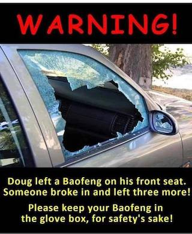
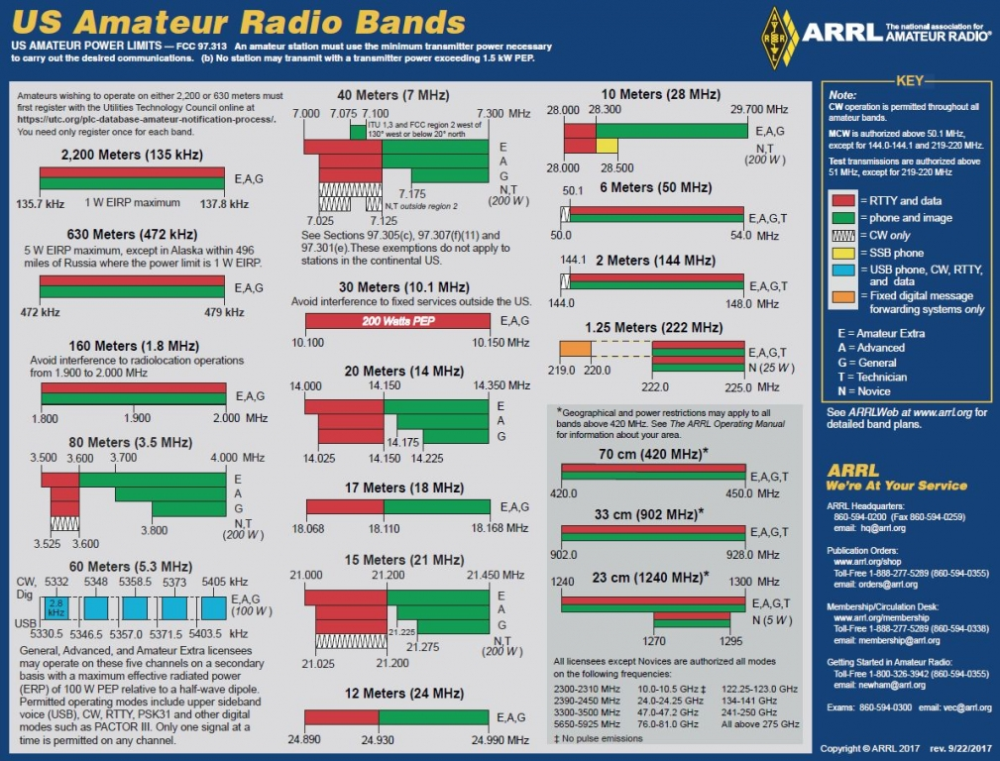

Getting Started Series                                   
:---------------------------------------
[Get On The Air](./get-on-the-air)
[Radios](./radios)
[Antennas](./antennas)
[Operating](./operating)

---

>“Perfection is the enemy of progress.” — Winston Churchill

## Step One
Coming into ham radio completly blind can be overwhelming. My goal was to get on the air as quickly as possible in 3 steps:

1. Listen to as many bands as possible (no license required)
2. Make contact on the repeaters (VHF/UHF)
3. Make contact on High Frequency (HF)

You're job is to stay focused on getting on the air. **Don't go out and buy a bunch of equipment**. Ultimately my initial gear purchases happened over the course of a few months: [SDR Play](https://www.sdrplay.com/) --> Baofeng --> Yaesu FT-891. The gear aligned with my initial goals, and aside from antennas, should get me by for awhile before I need to upgrade.

The SDR play allowed me to listen to HF/VHF/UHF all for about $100. The Baofeng is not a favorite of the ham radio world, but its cheap and acessible. The Yaesu was my last purchase and is mobile but robust enough for digital modes.

This isn't a step-by-step guide. But I did try to stuff as much useful info in here as possible for anyone that is starting at step one.

## Information
- Books
- Local Club
- The internet
## The test(s)
- You want at least a General
- Print 2 copies of the ARRL band chart, laminate them and keep one in your shack 
**[ARRL Band Chart Download](http://www.arrl.org/files/file/Regulatory/Band%20Chart/Band%20Chart%20-%2011X17%20Color.pdf)**

- Hamstudy.org
	- Studying
		- Go through the questions multiple times
			- Dont guess
			- Take many practice tests
	- License levels
	- Remote
		- Over prepare
		- Dont waste people time
		- Clean your workspace

## Vanity Call Signs
- How and why to get them 
- Helpful resources
## Radios
- Do your homework
	- Dont just buy it because its pretty
- New vs. Used
- HT vs. Mobile vs. Base station 
- SDR vs Non-SDR
## Antennas
- Build vs buy
- Dipole via Home depot
- Jpole
- Grounding

## Misc.
- Coax
- Grouding
- Entry panel
- Branded gear
## Now that you are on the air
- Listen
- Finding nets
- Local repeaters
- Programming your HT
- Edecete
	- HF vs. Repeater