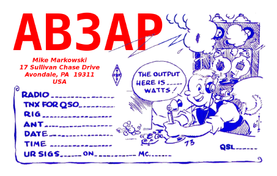

<!-- Getting Started Series                                   
:---------------------------------------
[Get On The Air](./get-on-the-air)
[Radios](./radios)
[Antennas](./antennas)
[Operating](./operating)

--- -->

## Radio Gradient
So you passed your test and even though you have your trusty Baofeng its time to upgrade. Buy carefully and deliberately. Its easy to gravitate towards the shiniest radio and everyone will have suggestions. Focus on getting on the air - its not all about the radio. The radio you chose should allow you to experiment in the areas of amateur radio you are interested in and not break the bank. Follow the natural gradient - buy just enough and buy up as your skills grow.

I heard folks on the local repeater talking up the Icom-7300, the VE that administered my general mentioned the same model after the test. Early on I was sure this was the transceiver I should buy. I resisted the urge and was glad I did. The information below helped me right size first big radio purchase.

## Let Your Interest Guide you
Some hams are fine with a Baofeng. They want to talk on the repeaters and socialize others in the area. Anything beyond that portion of the hobby and you need to start looking in to a high frequency (HF) rig. HF opens up long distance communications and digital. Long distance involves making QSO's (contact) with other hams. In some instances they will send you a QSL card. Digital allows email, RTTY and other modes that I will dive into as I get deeper into the hobby. Theres one more factor - **where** you will be using the radio. The Icom 7300 can be used in the field but its large and doesnt lend itself well to travel like a mobile transceiver.

## CQ POTA CQ POTA CQ POTA
One aspect of the hobby that interested me early on was [POTA - Parks on the Air](https://parksontheair.com/). POTA is "activating" a state or national park by operating within the parks boundaries and making 10 or more QSO's. There are activators and hunters. Activators are the operators and hunters are looking to make contact with the activators. All logs are submitted and awards are given based on a variety of different achievements. POTA seems very popular and activating a park requires a versatile radio that can be run off a battery.

`youtube:https://www.youtube.com/embed/U1L-5wl5rpQ`

	- HF vs UHF/VHF
	- SOTA POTA
	- Mobile
		- Offroad
		- Camping
		- Emergencies
- You will own multiple radios
- HT vs Mobile vs Base Station
	- Mobile - power supply
- New vs used
	- The benefit of new
	- Hamfests
	- QRZ
	- Craigslist & Ebay
- Leave some budget
	- Coax
	- Power poles
	- Lightning arresters
	- Entry panel
	- Antennas
	- Dummy load
	- Random cables (digital)
- Shack in a box
- All band vs dual band vs single band
	- Cost
	- How active are the repeaters on 2m and 70cm
- My choice