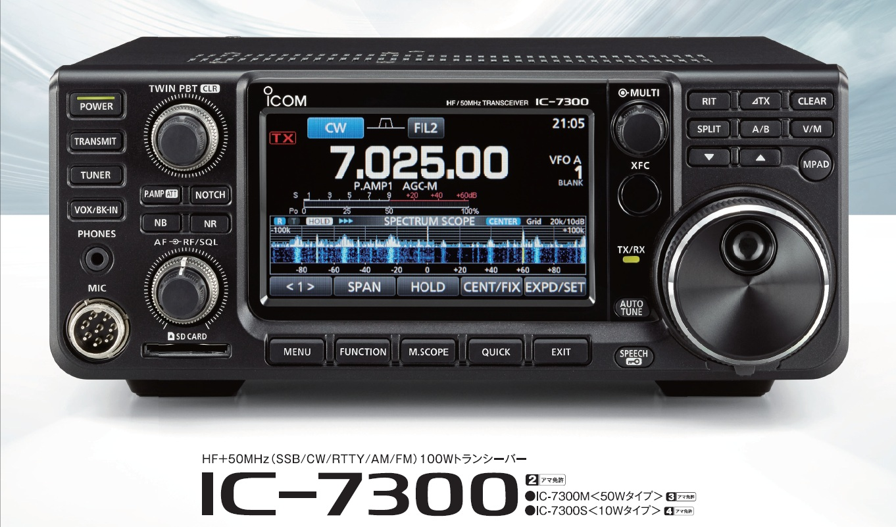
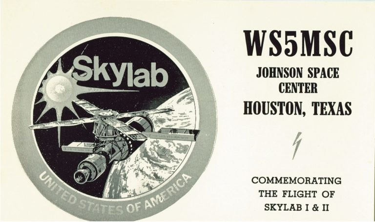

<!-- Getting Started Series                                   
:---------------------------------------
[Get On The Air](./get-on-the-air)
[Radios](./radios)
[Antennas](./antennas)
[Operating](./operating)

--- -->

## Radio Gradient
So you passed your test and even though you have your trusty Baofeng its time to upgrade. Buy carefully and deliberately. Its easy to gravitate towards the shiniest radio and everyone will have suggestions. Focus on getting on the air - its not *all* about the radio. The radio you chose should allow you to experiment in the areas of amateur radio you are interested in and not break the bank. Follow the natural gradient - buy just enough and buy up as your skills grow. You will probably own many radios as you get deeper into the hobby.

I heard folks on the local repeater talking up the Icom-7300, the VE that administered my general mentioned the same model after the test. Early on I was sure this was the transceiver I should buy. I resisted the urge and was glad I did. The information below helped me right size my first significant big radio purchase.

The 7300 is a great radio. If you have a limited budget make sure to save some room for coax, antennas and other miscellaneous items!

## Let Your Interest Guide you
Some hams are fine with a [HT (Handie Talkie)](https://en.wikipedia.org/wiki/Walkie-talkie). They want to talk on the repeaters and socialize with others in the area. Anything beyond that portion of the hobby and you need to start looking in to a larger rig. 

There are a number of things to consider when choosing your first serious transceiver. Are you interested in [High Frequency (HF)](https://en.wikipedia.org/wiki/High_frequency)? HF opens up long distance communications and provides many more opportunities for digital. Long distance involves making QSO's (contact) with other hams. In some instances they will send you a [QSL card](https://en.wikipedia.org/wiki/QSL_card) to commemorate your contact. QSL cards have been part of the hobby since the early 1900's.

 Digital allows email, RTTY and other modes that I will dive into as I get deeper into the hobby. You also need to consider **where** you will be using the radio. The Icom 7300 can be used in the field but it is large and doesn't lend itself well to travel like a mobile transceiver.

 Think about how amateur radio fits into your existing hobbies and lifestyle. If you are into hiking a high end HT might be where you focus, if you belong to an offroad club and spend a lot of time driving remote areas you should probably consider a robust mobile rig that covers some portion of the HF spectrum. How you currently spend your time should be a major consideration when deciding on your first transceiver.

## CQ POTA CQ POTA CQ POTA
One aspect of the hobby that interested me early on was [POTA - Parks on the Air](https://parksontheair.com/). POTA is "activating" a state or national park by operating within the parks boundaries and making 10 or more QSO's. There are activators and hunters. Activators are the operators and hunters are looking to make contact with the activators. All logs are submitted and awards are given based on a variety of different achievements. POTA is very popular and activating a park requires a versatile radio that can be run off a battery. If you do chose a mobile transceiver that you will also operate from your shack make sure you budget for a power supply.

Operating from a picnic table or cabin without power was a big driver for my transceiver choice.

`youtube:https://www.youtube.com/embed/U1L-5wl5rpQ`

## Shack In A Box
If your interests are broad and you have the budget you can look into a shack in a box. These are all band all mode transceivers such as the [Icom 7100](https://www.hamradio.com/detail.cfm?pid=H0-011766). I don't have any strong opinion one way or another on these transceivers but my hunch is it probably requires a compromise somewhere - maybe portability, or usability. Its worth considering if you have the cash. 

## New vs. Used
I bought new. There are **A LOT** of variables when it comes to ham radio - SWR, RF interference, grounding, lack of expertise, etc. I am willing ot spend a couple extra dollars removing as many of those variables as possible. In this case it was any potential problems with a radio. I will probably look at lightly used gear for my next purchase, a dual band 2m/70cm mobile transceiver. But for now I have no regrets buying my mobile HF rig new.

Used gear on our local craigslist is hit or miss, and some items on ebay can be more expensive than buying new (I have no idea how that works). Buying from members of your local club or a hamfest seem to be your best bet. There are deals to be had but as always *buyer beware*.

If you are buying new I would recommend going through a reputable dealer who specializes in ham radio. [Ham Radio Outlet](https://www.hamradio.com/) and [DX Engineering](https://www.dxengineering.com/) seem to be two popular options. 

I do not follow the same buying rules for antennas. A lot of hams sell their own version of antennas on ebay, Etsy, and elsewhere. I encourage you to support them by buying their special sauce end-fed, or tried and true J-Pole.

## The Other Stuff
In this getting started series I am focusing on the ['just get on the air'](./get-on-the-air) approach which is the bare minimum. Leave budget to build out your shack, it adds up quick.
- Coax
- Lightning arresters
- Entry panel
- Antennas
- Antenna tuner
- SWR meter
- Dummy load
- Random cables

## My Choice
I ultimately chose a [Yaesu FT-891](https://www.yaesu.com/airband/indexVS.cfm?cmd=DisplayProducts&ProdCatID=102&encProdID=DF4DB262968932E999EAF928B5B6A1A7). Largely driven by its portability and ability to work digital modes. For me it was not too big and not too small. While I had a cheap power supply laying around from another project I chose to buy the  Yaesu brand power supply to minimize any potential issues. So far I am very happy with my purchase, but its early and its winter here in Colorado. I plan on providing a follow up review after I have spent some more time getting my hands dirty.

## Whats The Right Choice
Whatever meets the goal of the mission is the best choice for you. Do your homework but don't fall into analysis paralysis. This is the first transceiver you will buy but certainly not the last. 