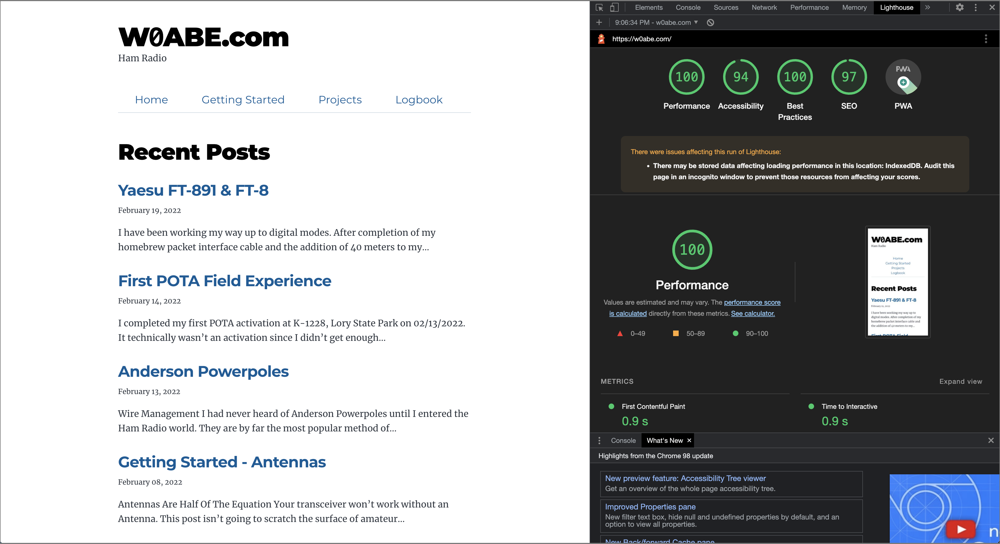
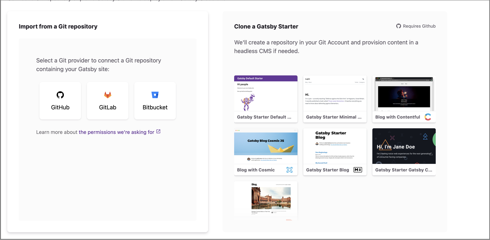

This blog post documents how I host a blog for $1/year*. That asterick should be bigger. The $1 blog is only for the first year and it's certainly not batteries included... but it's only a buck so you can't really complain.

This post assumes you have basic web development experience. If you don't it's a great opportunity to experiment. At a minimum you will need a text editor such as [VS Code](https://code.visualstudio.com/), a package manager, I recommend [Yarn.js](https://yarnpkg.com/) or [NPM.js](https://www.npmjs.com/), [React.js](https://reactjs.org/), and [GraphQL](https://graphql.org/). I don't go deep on each step. Be prepared to cough up a buck and see how it goes. I bet you have spent A LOT more on amateur radio gear :)

## TL;DR
- Domain Name: [Ionos](https://www.ionos.com/)
- Blog: [Gatsby.js](https://www.gatsbyjs.com/) & [Gatsby Starter Blog](https://www.gatsbyjs.com/starters/gatsbyjs/gatsby-starter-blog)
- Hosting: [Gatsby Cloud](https://www.gatsbyjs.com/products/cloud/)

## How I Got Here
This all started when I wanted the email address for my vanity call sign. Gmail requires more than 5 characters which led me to buying the domain name for my call sign. After finding a domain that only cost a dollar from [Ionos](https://www.ionos.com/) I began to wonder what I could do with it.

The most substantial cost of any web page these days is persistent storage. No matter what database you choose it will cost you. The closest alternative to the $1 blog is a wordpress instance which will cost you at a minimum of $3/ month. Remove persistent storage and you can host a blog for next to nothing. Enter [Gatsby.js](https://www.gatsbyjs.com/).

Gatsby.js is a static site generator. In layman's terms it generates vanilla HTML. WhatQ the benefit? A blazing fast blog that adheres to modern web standards. The drawback - not much comes out-of-the-box. 

Blazing fast is relevant since search engines now prioritize user experience, load times, accessability, and adherence to modern standards. These factors now dictate where you rank in terms of search results. This is good news for users but bad news for traditional Ham Radio websites.

*Chrome's Lighthouse report*

## The *$1/ Year Blog

The first step is to get the domain name for your call sign from [Ionos](https://www.ionos.com/). There may be other sites that you can get a domain for $1 for the first year but at the time of writing Ionos is it. It really doesn't matter where you get your domain from as long as the price is right.

Next clone the [Gatsby Starter Blog](https://www.gatsbyjs.com/starters/gatsbyjs/gatsby-starter-blog) - look familiar? This requires knowledge of git. If you know the basics keep trudging ahead, if you don't now is a good time to [dig in](https://www.freecodecamp.org/news/learn-the-basics-of-git-in-under-10-minutes-da548267cc91/).

From the terminal...

install dependencies
    
    yarn install

local development 
    
    yarn develop

Navigate to [http://localhost:8000](http://localhost:8000) to view your new blog.

Gastby uses [React.js](https://reactjs.org/) to generate your sites static content. Blog posts are simply [Markdown](https://en.wikipedia.org/wiki/Markdown) files. [GraphQL](https://graphql.org/) is utilized to query content. Im not going to go deep on these technologies. On their own they could fill an entire blog. Remember, you are out a buck. Embrace it and see what you can do!

*Associate your repo with Gatsby cloud*

## Hosting
At this point you have a domain name and a github repo with a blog. Let's bring it home by hosting our new blog on [Gatsby Cloud](https://www.gatsbyjs.com/products/cloud/). Gatsby cloud will send your blog through a deployment pipeline and notify you of any issues whenever you push new changes to your repo. First associate your repo with Gatsby cloud by clicking 'Add Site' and choosing your version control provider (most likely GitHub).

Once your repo hooked up follow the steps from Gatsby Cloud help to [add your custom domain](https://support.gatsbyjs.com/hc/en-us/articles/360063469873-Adding-a-Custom-Domain).

## Customize
If all went well you should be able to access your blog on your custom domain. From here you can start to customize. Remember I said nothing out-of-the-box - you will notice there is no search, no tags, or really organization of any kind. The world is full of abandoned blogs, take a deep breath and focus on content.

Now is a good time to browse [Gatsby.js Plugins](https://www.gatsbyjs.com/plugins) to determine what can help round out your blog. If you are comfortable with React you can build a component and integrate it with your new blog. If you aren't familiar with React then congratulations you have a new side project! 

I added pages to my blog that focus on Getting Started and Project content. My plan is to let it evolve over time or let it slowly waste away with the other neglected blogs on the internet. 