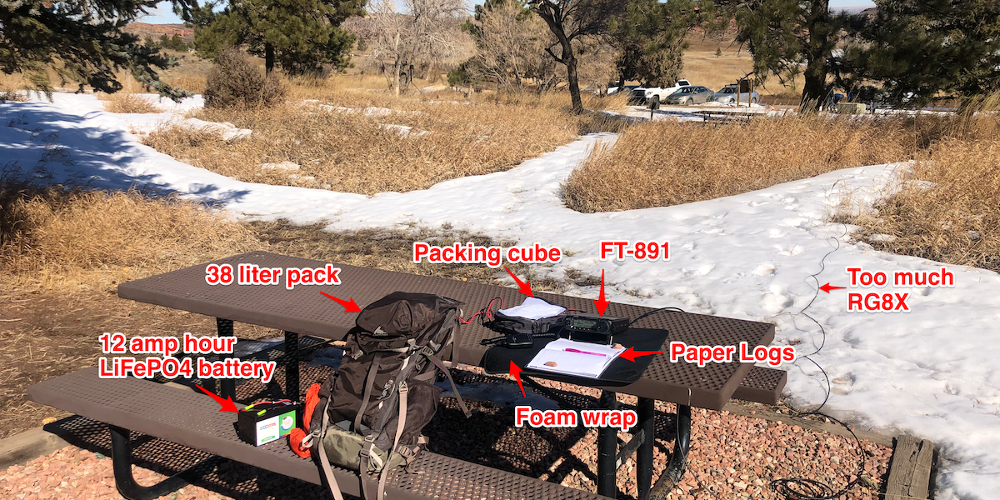
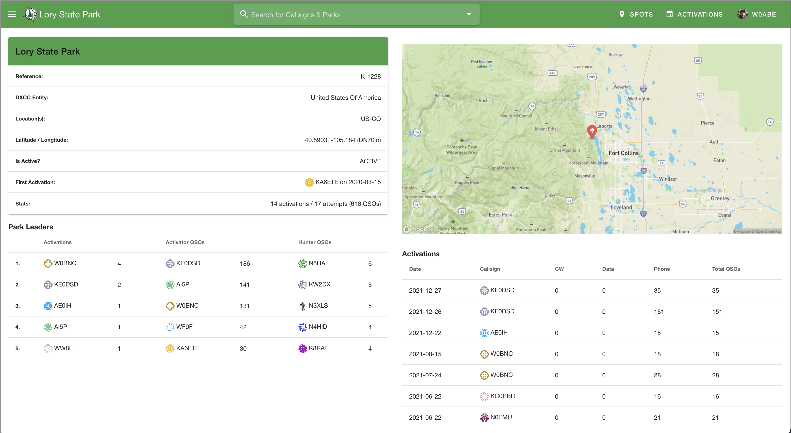

 
<!-- Getting Started Series                                  
:---------------------------------------
[Get On The Air](./get-on-the-air)
[Radios](./radios)
[Antennas](./antennas)
[Operating](./operating) -->
 
I completed my first [POTA](https://parksontheair.com/) activation at K-1228, Lory State Park on 02/13/2022. It technically wasn't an activation since I didn't get enough contacts, but I had a great time and it was an opportunity to take all my new gear out for a test run. I'm going to continue to hunt at home and plan to give activation another shot next weekend.

*My POTA Setup*

## Challenges
It was sunny and in the mid-50's when I managed to get out of the house. K-1228 is minutes away from my front door but I only had a little over an hour for POTA. This was my first mistake. I'm sure as I streamline my setup and gear and hour will be plenty of time but for the maiden voyage, it wasn't quite enough. As agreeable as the weather was it was windy and my paper logs would get unruly at times. I'm going to stick with paper logs until it dries out here a bit or I outfit my truck with an antenna so I can sit in the cab if it's gross out.

There is no cell service at the park so I couldn't self-spot or see what frequencies everyone else was on. This wasn't a deal-breaker but it's definitely different than when you are at home enjoying fast wifi.

*[K-1228 Lory State Park, Colorado](https://pota.app/#/park/K-1228)*

Finally, I was the last challenge. It seemed like a busy Sunday on the air and I had a hard time finding a frequency to sit on and call CQ. I could have been more patient before running up and down the dial looking for a park-to-park.

There were challenges but that's half the fun.
## Gear
The night before my outing I managed to add [Anderson Powerpoles](./powerpoles/) to my setup. This made disconnecting from my desk and hooking up to my battery a breeze. I took my FT-891 transceiver and left the antenna tuner at home. The end-fed antenna did just fine without it. For power, I purchased a 12 amp hour LiFePO4 battery and ran 80 watts while operating. My gear worked great and overall I'm happy with my setup.

### Gear List
- [Yaesu FT-891](https://www.dxengineering.com/parts/ysu-ft-891)
- [Ultra-Light End Fed Sloper Antenna](https://ka6ete.com/ulwefs)
- [Zooms 12ah LiFePO4 battery](https://www.amazon.com/gp/product/B09B7H7RYR/ref=ppx_yo_dt_b_asin_title_o05_s00?ie=UTF8&th=1)
- [Neoprene Wrap](https://www.amazon.com/gp/product/B072KLRR8X/ref=ppx_yo_dt_b_asin_image_o04_s01?ie=UTF8&th=1)
- [Packing Cubes](https://www.walmart.com/ip/Protege-Organizing-Packing-Cube-Set-Charcoal-3-Pieces/143088835)

## Contacts
I'm still getting the hang of ham radio contacts. I mean it's not rocket science but operating outside didn't make it easier. It doesn't quite feel like second nature so if I forgot to provide a signal report I apologize. My next outing I expect to be a little more composed.

## Processing Logs
I didn't think too much about processing logs until I got home. This part of the process felt clunky and I would love feedback on the best way to streamline this process. The steps outlined in the blog post [Logging for POTA](https://www.khk.net/wordpress/2020/01/02/logging-for-pota/) by Karl Heinz Kremer seems good enough for now. I'm either on a Mac or Linux machine so I'm not sure how many options there are for logging. My assumption is this is a fairly manual process for everyone involved until the technical minutia is ironed out enough to automate it?

## POTA is Fun!
I definitely plan on diving deeper into POTA. I enjoy the prep, planning, and execution of it all and everyone I made contact with was extremely nice. I hope to have everything dialed in enough that I am able to hike in and operate. Thank you to everyone I made contact with and the folks at POTA that volunteer their time to make this all possible. 