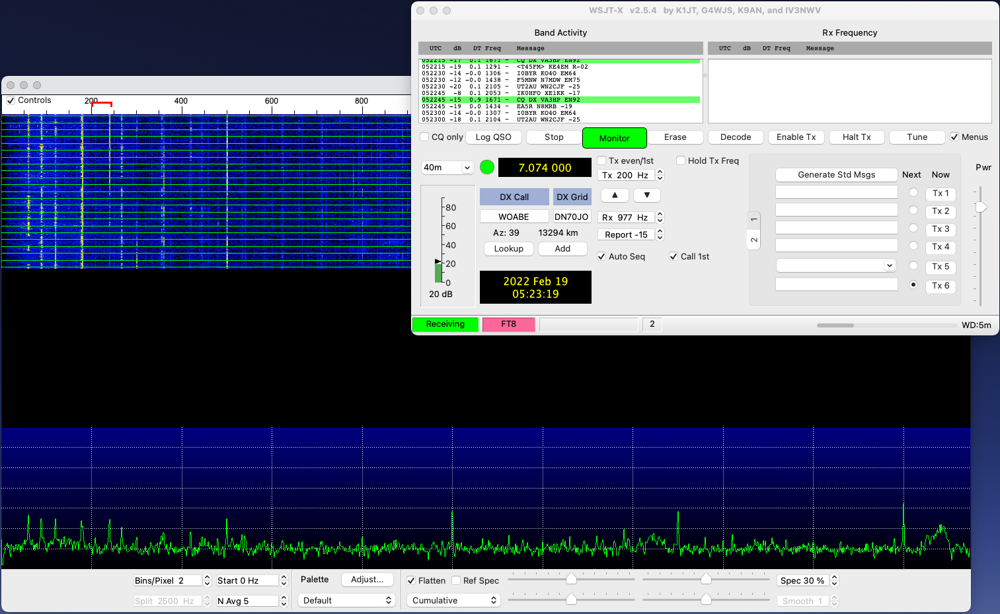

 
I have been working my way up to digital modes. After completion of my homebrew packet interface cable and the addition of 40 meters to my homebrew dipole (now a fan dipole) I thought I would give it a shot. I followed the steps outline in [AA0O's blog post](https://aa0o.radio/2019/04/13/yaesu-ft-891-ft8-usb-c-mac-ps-2-cable/) to assemble the cable and general setup. I tweaked the FT-891 settings a bit to get everything running. 

Building the packet interface cable allows you to avoid using (or buying) additional hardware like a [SignalLink USB](https://www.hamradio.com/detail.cfm?pid=H0-009906). I believe there are benefits to using a dedicated device but for my purposes I just wanted to get started as quickly and cheaply as possible. 

*Homebrew packet interface cable*

## Challenges
The packet interface cable was pretty straightforward. Be aware you are working with very, very small wires. I followed the "use a lighter method" and it worked well enough. Make sure you hold the flame to the ire just long enough to soften it. 

`youtube:https://www.youtube.com/embed/n5o2drU65UM`
*How to strip real small wires*

Give yourself enough wire length to work with. I was a little too conservative and it was a tight squeeze when I attached everything with electrical tape. Now that I have verified it works as expected I plan to solder the connections and use heat shrink tube to add durability. 

To hook my new cable up to my rig I purchased a[USB Type-C Stereo adaptor](https://www.amazon.com/dp/B071HJ98Q6?psc=1&ref=ppx_yo2_dt_b_product_details). Ensure the correct audio plugs are plugged into the appropriate spots on the adaptor. If you're having problems at the end switch them up and see if that gets you going.

## FT-891 Settings

Apply the settings below to enable digital modes on the FT-891. I'm not promising these are the optimal configs, but they worked well for FT-8. I haven't made it far enough to understand if these are the be-all-end-all digital settings for the FT-891.

| Setting | Name | Value |
|---|---|---|
| 05-06 | CAT RATE |  9600bps
| 05-07 | CAT TOT |  1000msec
| 05-08 | CAT RTS | DISABLE
| 07-12 | PC KEYING | RTS
| 08-01 | DATA MODE | PSK
| 08-03 | OTHER DISP | 1500Hz
| 08-04 | OTHER SHIFT | 1500Hz
| 08-05 | DATA LCUT FREQ | OFF
| 08-07 | DATA HCUT FREQ | OFF
| 08-09 | DATA IN SELECT | REAR
| 08-10 | DATA PTT SELECT | DAKY
| 08-11 | DATA OUT LEVEL | 50
| 08-12 | DATA BFO | USB
| 16-14 | DATA DATA GAIN | 40

`youtube:https://www.youtube.com/embed/DoYL-7N6eb4`
*KB9VBR also has a helpful video focused on the FT-891*

## WSJTX
I used my MacBook Pro and the [WSJTX](https://www.physics.princeton.edu/pulsar/k1jt/wsjtx.html) install was pretty straight forward. Do use the README file provided to walk through the additional installation instructions. If CAT control isn't playing along ensure the baud rate in WSJTX matches the 05-06 setting.

*Success!*

## Logging
For logging the AA0O blog suggests RUMlogNG. So far RUMlogNG has solved my problems for generating POTA logs, and integrating with WSJTX. [MacLoggerDX](https://dogparksoftware.com/MacLoggerDX.html) seems to be a more robust (but not free) logging solution for Mac. I'm interested to see if I end up shelling out the money for a license as I get deeper into the hobby. For the time being free does the job.

## Making QSOs
Making QSOs isn't straightforward at first. But as long as you see information coming in on the left side of the screen you can start to make some contacts.

`youtube:https://www.youtube.com/embed/DkqaCGIe9P0`
*Making FT8 QSOs with WSJT-x on 20M*