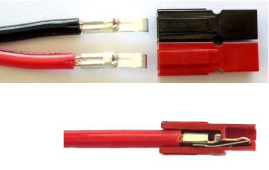

 
<!-- Getting Started Series                                  
:---------------------------------------
[Get On The Air](./get-on-the-air)
[Radios](./radios)
[Antennas](./antennas)
[Operating](./operating) -->
 
 ## Wire Management
I had never heard of [Anderson Powerpoles](https://en.wikipedia.org/wiki/Anderson_Powerpole) until I entered the Ham Radio world. They are by far the most popular method of connecting rigs to and from power supplies and other sources. To simplify disconnecting from my AC power supply and connecting to my battery I added Powerpole connectors to my setup.

*Anderson Powerpole Cutaway*

>Powerpole connectors are physically and electrically hermaphroditic, thus avoiding the need to worry about which end is the plug and which the socket, or which end has the correct polarity. This is in contrast to the physically- but not electrically-hermaphroditic two-wire trailer plug

Andersen sells a crimping tool specifically for their product that can cost up to $45! I chose not to buy it and opted instead to use the manual method. So far it has worked just fine and I managed to save a few bucks. Follow the instructions in the video and make sure you solder the connections.

`youtube:https://www.youtube.com/embed/ZIPjyS_4ZP8`
*[Crimping Anderson Powerpoles Manually](https://www.instructables.com/Crimping-Anderson-Powerpoles-Manually/)*

As you work with thicker wires, standard PL 259 connectors, and other ham radio gear that requires more heat than a pencil soldering iron or even a soldering gun can provide you should pick up a micro butane torch. Home Depot sells a [$30 micro torch](https://www.homedepot.com/p/Bernzomatic-ST2200T-Butane-Micro-Torch-330194/100564678) in the soldering iron section. Just one isle over in the electronic connectors section some HD stores will sell a generic brand that is $10 cheaper. The cheaper torch has worked fine for my needs. Do your homework before you head out.

The [30 amp connectors](https://powerwerx.com/anderson-powerpole-connectors-30amp-bonded) are a tight squeeze. I managed to get all the wire in, but if I could do it again I would have went with the [45 amp](https://powerwerx.com/anderson-powerpole-connectors-45amp-bonded). The connectors are all the same size, its just the metal tabs that vary based on the amperage rating.
The [plastic boots](https://www.amazon.com/gp/product/B08FMKHR1N/ref=ppx_yo_dt_b_asin_title_o01_s00?ie=UTF8&psc=1) were ordered from Amazon. I used heat shrink and the boots to add a bit more protection from the elements and stress from bends.

*The finished product*

The Powerpoles provide a satisfying snap when you connect them and you don't have to work too hard to connect or disconnect. I plan to add the Powerpoles when I wire my truck up to easily switch transceivers. Overall I'm pretty happy with how it all turned out.

 